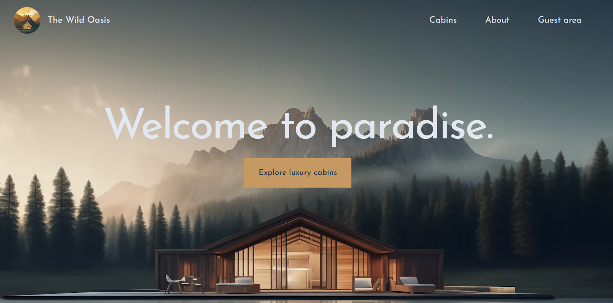
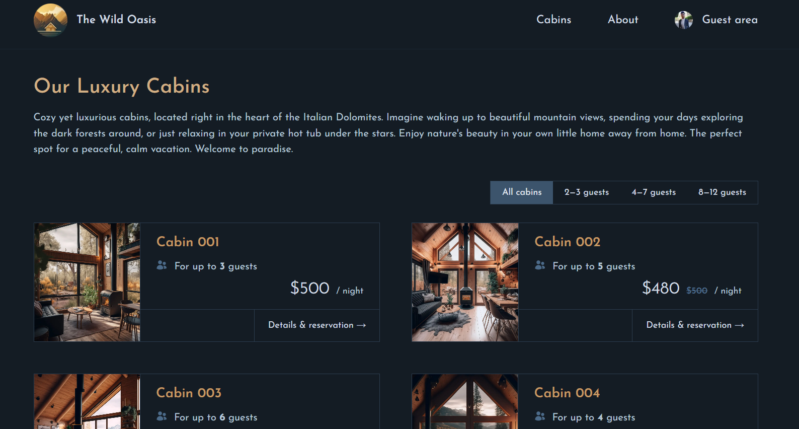
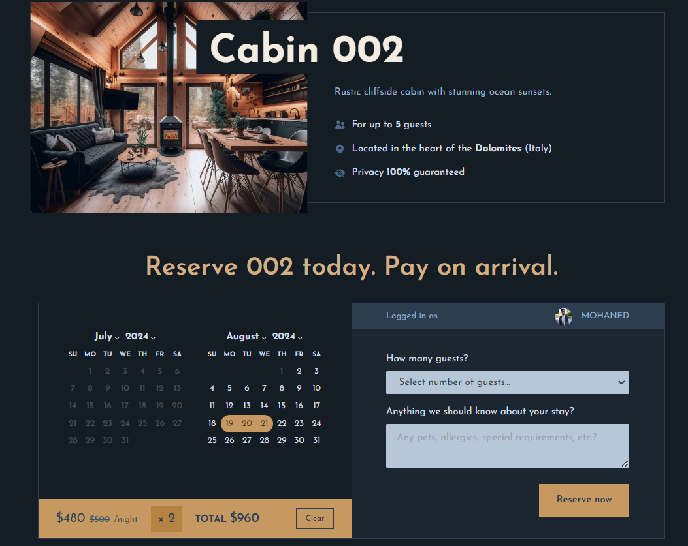
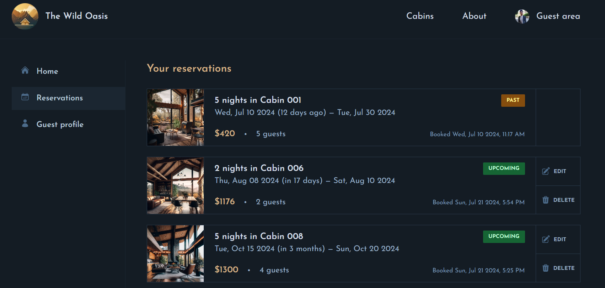
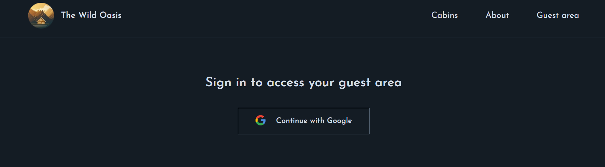
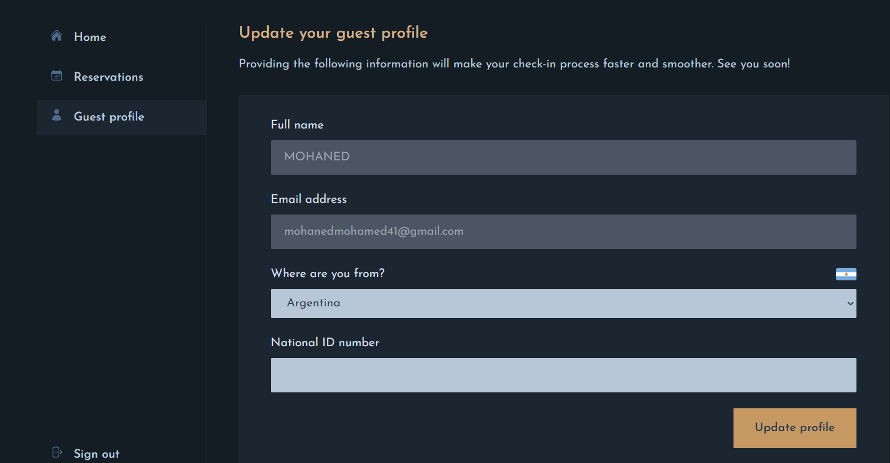

<br />
<div align="center">
  <h1 align="center">The Wild Oasis</h1>
  <p align="center">
  
   </p>
</div>

<details>
  <summary>Table of Contents</summary>
  <ol>
    <li>
      <a href="#about-the-project">About The Project</a>
      <ul>
        <li><a href="#Technologies">Technologies</a></li>
      </ul>
    </li>
    <li>
      <a href="#getting-started">Getting Started</a>
      <ul>
        <li><a href="#prerequisites">Prerequisites</a></li>
        <li><a href="#installation">Installation</a></li>
      </ul>
    </li>
    <li><a href="#Clint-Side">Usage</a></li>
    <li><a href="#contact">Contact</a></li>
  </ol>
</details>

<!-- ABOUT THE PROJECT -->

## About The Project


The Wild Oasis is a fancy getaway website with high-end cabins in nature where users can select cabins and reserve it.

### Technologies

- [![[NextJs]][Next.js]][Next-url]
- [![SUPABASE][supabase.com]][supabase-url]
- [![NEXTAUTH][NextAuth.js]][NextAuth-url]

<!-- GETTING STARTED -->

## Getting Started

Follow next steps to know how to run the App ☺.

### Prerequisites

- [NodeJS](https://nodejs.org/en)

### Installation

1. Clone the repo or you can download it

   ```sh
   git clone https://github.com/MohanedMohamedKhalil/Wild-Oasis.git
   ```

2. move to client-side folder and open cmd or visual-studio terminal .

   ```js
    npm install
   npm run dev ;
   ```

List of Packages for development .

```sh
// Backend

supabase


// Frontend

NextJs
NextAuth
react-day-picker
date-fns
heroIcons
tailWindCss
```

<!-- USAGE EXAMPLES -->

## Clint-Side

after all installations app will be run at http://localhost:3000

- Home Page
  

- Cabins Page
  

- Cabin Page
  

- Reservations Page
  

- Login Page
  

- Profile Page
  

<!-- ROADMAP -->

<!-- CONTACT -->

## Contact

mohanedmohamed41@gmail.com - [LinkendIn](https://www.linkedin.com/in/mohaned-mohamed-khalil/)

<!-- Icons -->

[Next.js]: https://img.shields.io/badge/Next-white?style=for-the-badge&logo=nextjs&logoColor=61DAFB
[Next-url]: https://nextjs.org/
[supabase.com]: https://img.shields.io/badge/supabase-green?style=for-the-badge&logo=supabase&logoColor=61DAFB
[supabase-url]: https://supabase.com/
[NextAuth.js]: https://img.shields.io/badge/NextAuth-black?style=for-the-badge&logo=NextAuth&badgeColor=010101
[NextAuth-url]: https://next-auth.js.org/
